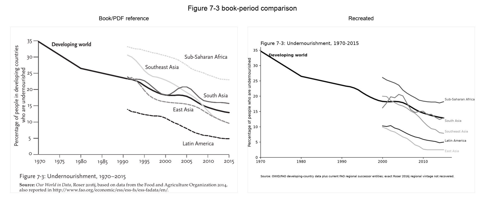
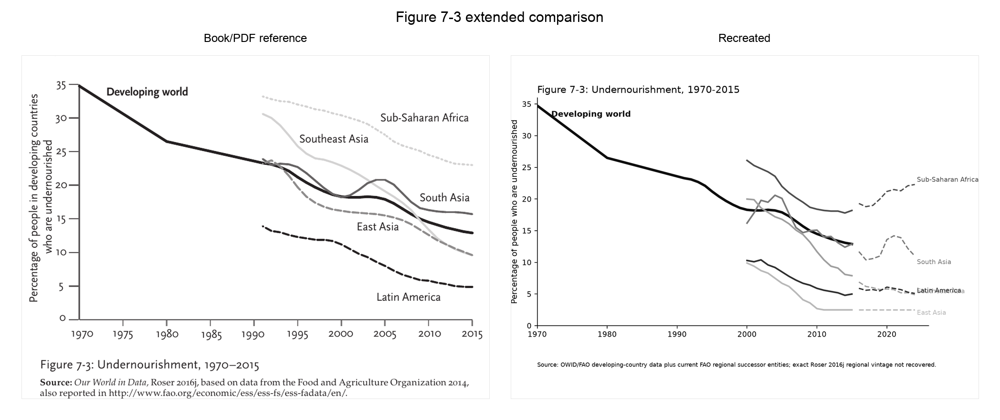
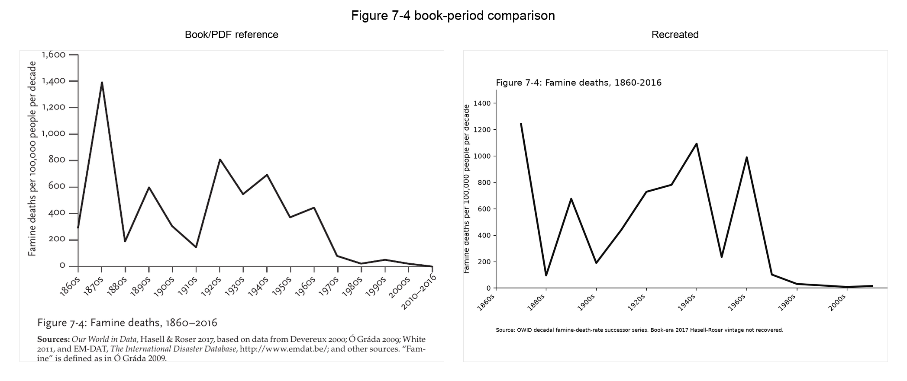
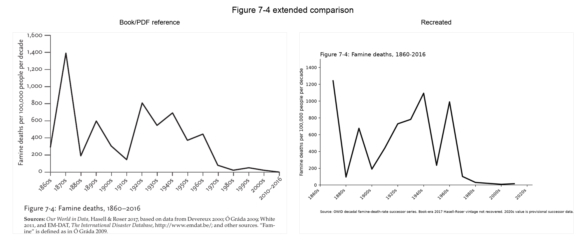
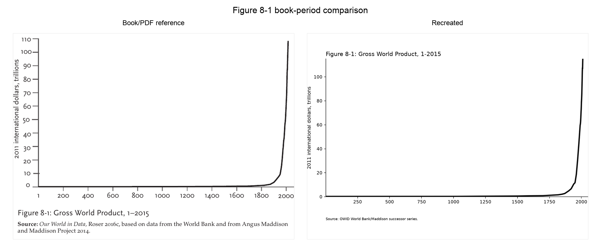
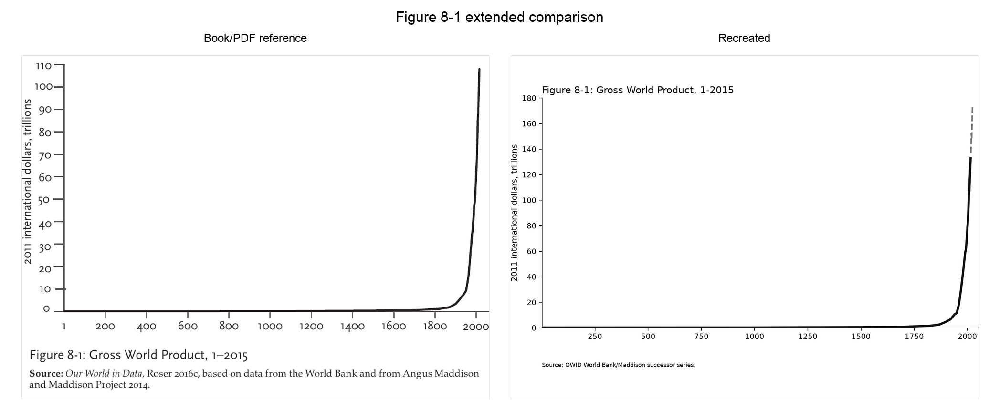
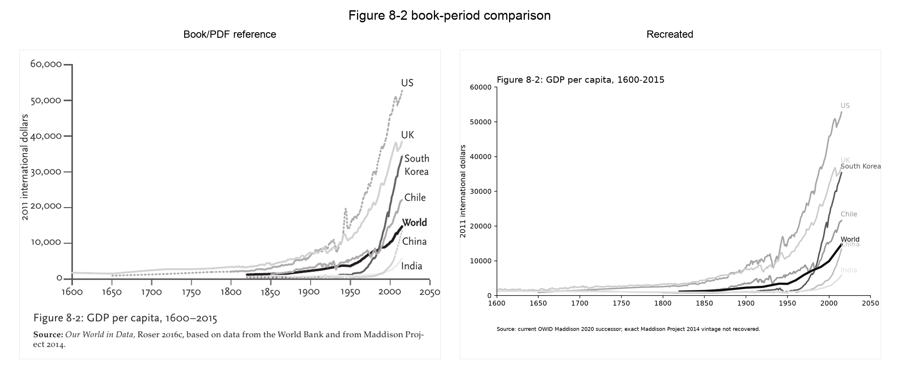
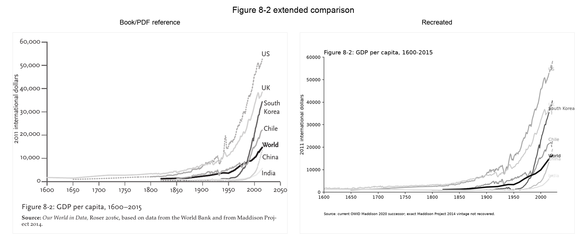
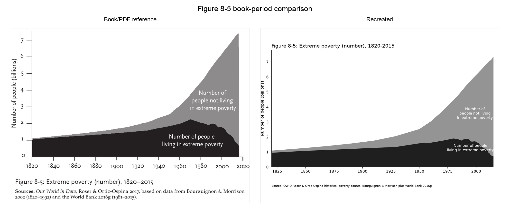

# Track B Editorial Remediation

Date: 2026-06-30

Scope: editorial review and remediation only. No new production-batch figures were started.

## Status Changes

| Figure | Previous status | Remediated status | Confidence | Decision |
| --- | --- | --- | --- | --- |
| 7-3 | `partial_match` | `partial_match` | medium-low | Retain partial_match and lower confidence. |
| 7-4 | `partial_match` | `partial_match` | medium-low | Retain partial_match and lower confidence. |
| 8-1 | `updated_equivalent` | `updated_equivalent` | medium | Do not promote to verified_reproduction. |
| 8-2 | `updated_equivalent` | `updated_equivalent` | medium | Retain updated_equivalent. |
| 8-5 | `verified_reproduction` | `verified_reproduction` | high | Retain verified_reproduction. |

## Figure 7-3 Series Audit

| Series | Original | Recreated | Match |
| --- | --- | --- | --- |
| Developing world | Present, 1970-2015 main black line. | Recovered from OWID/FAO developing-country dataset, 1970-2015. | Good source-family match. |
| Sub-Saharan Africa | Present, early-1990s-2015 regional line. | Current FAO successor entity `Sub-Saharan Africa (FAO)`, 2000-2015 book-period subset. | Partial; early years missing and vintage differs. |
| Southeast Asia | Present, early-1990s-2015 regional line. | Current FAO successor entity `South-eastern Asia (FAO)`, 2000-2015 book-period subset. | Partial; early years missing and naming/vintage differ. |
| South Asia | Present, early-1990s-2015 regional line. | Current FAO successor entity `Southern Asia (FAO)`, 2000-2015 book-period subset. | Partial; source-family curve only. |
| East Asia | Present, early-1990s-2015 regional line. | Current FAO successor entity `Eastern Asia (FAO)`, 2000-2015 book-period subset. | Weak partial; levels/trend are revised and early years missing. |
| Latin America | Present, early-1990s-2015 regional line. | Current FAO successor entity `Latin America and the Caribbean (FAO)`, 2000-2015 book-period subset. | Partial; early years missing and regional definition is broader label. |
| World | Absent from original. | Removed from book-period recreation; retained only as a documented successor diagnostic if needed. | Prior substitution corrected. |

## Per-Figure Findings

### Figure 7-3 - Undernourishment, 1970-2015

Fresh review found that the prior reconstruction substituted broad Africa/Asia/World curves for several book regional curves. The remediation replaces those with current FAO successor regional entities where available, but the exact Roser 2016j/FAO 2014 regional vintage and 1991-1999 regional segments remain unrecovered.

#### Reviewer Challenge

- **What would Steven Pinker question?** Whether each book regional curve is present and named correctly. Resolved partly: labels now target the right FAO successor regions; documented blocker: exact 1991-2015 regional vintage missing.
- **What would a skeptical data journalist question?** Whether Africa/Asia/World substitutions hid missing series. Resolved: World substitution removed; broad-region substitutions replaced with specific successor region entities.
- **What would another researcher question?** Whether current FAO 2000-2024 values can stand in for FAO 2014. Documented as a research task, not treated as verified.

#### Scorecard

| Criterion | Score (1-5) | Justification |
| --- | ---: | --- |
| Source recovery | 2 | Main developing-world line is recovered; regional book vintage is not. |
| Citation chain | 3 | FAO/OWID chain is documented, but Roser 2016j regional file remains missing. |
| Visual similarity | 2 | Improved regional labels and removed World substitution, but regional curves start at 2000 rather than the book's early-1990s coverage. |
| Extension quality | 3 | Current FAO successor extends to 2024 and is clearly separated as successor evidence. |
| Caption quality | 4 | Caption now states the substitution risk and missing vintage. |
| Editorial quality | 4 | Status is not over-promoted and discrepancies are explicit. |
| Overall confidence | 2 | Useful source-family partial match only. |

#### Updated Comparisons

### Figure 7-4 - Famine deaths, 1860-2016

The previous reconstruction recomputed rates from an event table with a current population denominator. Remediation uses OWID's explicit decadal famine-death-rate grapher series, which fixes the aggregation treatment, but it is a 2025 World Peace Foundation/OWID successor rather than the archived 2017 Hasell-Roser book vintage.

#### Reviewer Challenge

- **What would Steven Pinker question?** Whether the declining decadal rate is computed the same way as the book. Partly resolved with OWID's own decadal-rate series; vintage remains documented.
- **What would a skeptical data journalist question?** Whether the endpoint and smoothing were manipulated. Resolved/documented: no smoothing; decade-start bins; 2020s only in successor extension.
- **What would another researcher question?** Whether revised WPF 2025 rates are comparable with Hasell-Roser 2017. Documented as source-vintage blocker.

#### Scorecard

| Criterion | Score (1-5) | Justification |
| --- | ---: | --- |
| Source recovery | 3 | Event table and current OWID decadal-rate successor recovered; exact archived 2017 grapher not recovered. |
| Citation chain | 3 | Hasell-Roser/OWID and successor WPF/OWID chains are documented separately. |
| Visual similarity | 3 | Decadal rate shape improves, but the successor series starts at 1870 and includes revised rates. |
| Extension quality | 3 | 2020s successor exists but is provisional and not book-comparable. |
| Caption quality | 4 | Caption explicitly names aggregation and vintage differences. |
| Editorial quality | 4 | Confidence lowered and prior recomputation caveat documented. |
| Overall confidence | 3 | Better aggregation fidelity, still not an exact book reproduction. |

#### Updated Comparisons

### Figure 8-1 - Gross World Product, 1-2015

The successor OWID/Maddison/World Bank series preserves the hockey-stick shape and book-period coverage, but the 2015 scale is materially above the printed figure's apparent endpoint, so this is an updated equivalent rather than an exact reproduction.

#### Reviewer Challenge

- **What would Steven Pinker question?** Whether the near-vertical post-1800 rise remains visible. Resolved: yes.
- **What would a skeptical data journalist question?** Why 2015 scale is higher than the book. Documented: current successor data revisions prevent verified reproduction.
- **What would another researcher question?** Whether Maddison Project 2014 was recovered. Documented as outstanding source task.

#### Scorecard

| Criterion | Score (1-5) | Justification |
| --- | ---: | --- |
| Source recovery | 4 | OWID successor source family recovered, but exact 2016c archive is absent. |
| Citation chain | 4 | Maddison/World Bank source chain is clear. |
| Visual similarity | 4 | Shape is very close; endpoint scale differs from the book. |
| Extension quality | 4 | Post-2015 extension is coherent successor data. |
| Caption quality | 4 | Caption identifies successor vintage and scale caveat. |
| Editorial quality | 4 | Not promoted above evidence. |
| Overall confidence | 4 | Strong updated equivalent, not verified. |

#### Updated Comparisons

### Figure 8-2 - GDP per capita, 1600-2015

The selected countries and line ordering broadly match the book, but current Maddison 2020/OWID data are not the cited Maddison Project 2014/World Bank 2016 vintage. Remaining differences are not typography-only.

#### Reviewer Challenge

- **What would Steven Pinker question?** Whether the selected countries and ordering still communicate uneven enrichment. Resolved: yes, with label caveats.
- **What would a skeptical data journalist question?** Whether label overlap conceals country ranking differences. Documented: placement improved only modestly; source differences remain.
- **What would another researcher question?** Whether current Maddison 2020 is source-equivalent to Maddison 2014. Documented: no, status remains updated_equivalent.

#### Scorecard

| Criterion | Score (1-5) | Justification |
| --- | ---: | --- |
| Source recovery | 3 | Current Maddison 2020 series recovered; Maddison Project 2014 vintage not recovered. |
| Citation chain | 4 | Country series source family is well documented. |
| Visual similarity | 3 | Country set/order match broadly, with label overlap and revised levels. |
| Extension quality | 4 | Extension is consistent with the successor dataset. |
| Caption quality | 4 | Caption distinguishes typography issues from source vintage issues. |
| Editorial quality | 4 | Classification remains conservative. |
| Overall confidence | 3 | Good update, not source-identical. |

#### Updated Comparisons

### Figure 8-5 - Extreme poverty (number), 1820-2015

A falsification audit found no material source, encoding, or endpoint issue. The reconstruction uses the cited OWID historical absolute-count series and matches the stacked-area visual claim; remaining differences are production styling only.

#### Reviewer Challenge

- **What would Steven Pinker question?** Whether the absolute number in extreme poverty falls while non-poor population rises. Resolved: yes.
- **What would a skeptical data journalist question?** Whether the stacked areas swap categories or hide a post-2015 update. Resolved: categories verified; no successor extension plotted.
- **What would another researcher question?** Whether the cited historical count series is recovered. Resolved: yes, retained verified_reproduction.

#### Scorecard

| Criterion | Score (1-5) | Justification |
| --- | ---: | --- |
| Source recovery | 5 | Cited OWID absolute-count source is recovered. |
| Citation chain | 5 | Bourguignon-Morrison and World Bank/PovcalNet chain is explicit. |
| Visual similarity | 4 | Stacked areas and endpoint behavior match; only production styling differs. |
| Extension quality | 4 | No comparable extension is plotted, avoiding false comparability. |
| Caption quality | 5 | Caption accurately states source and no-extension treatment. |
| Editorial quality | 5 | Classification survived falsification audit. |
| Overall confidence | 5 | Verified reproduction remains justified. |

#### Updated Comparisons

## Remaining Blockers

- Figure 7-3: exact Roser 2016j / FAO 2014 regional data with early-1990s coverage remains unrecovered.
- Figure 7-4: exact archived 2017 Hasell-Roser OWID decadal-rate output remains unrecovered; current WPF/OWID successor is documented separately.
- Figure 8-1: exact OWID Roser 2016c/Maddison Project 2014 GDP vintage remains unrecovered.
- Figure 8-2: exact Maddison Project 2014/World Bank vintage remains unrecovered.
- Figure 8-5: no material blocker after audit.
